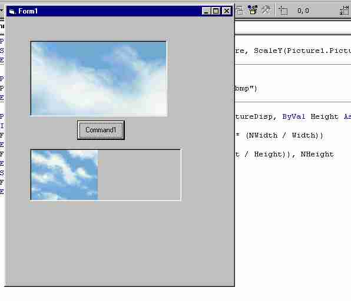



## Smart Stretch

### Description

This code allows you to stretch a picture without losing it's aspect ratio of Height/Width.
 
### More Info
 

             |
---                |---
**Submitted On**   |2002-06-15 09:08:18
**By**             |[Jonathan P\. Ivy](https://github.com/Planet-Source-Code/PSCIndex/blob/master/ByAuthor/jonathan-p-ivy.md)
**Level**          |Intermediate
**User Rating**    |4.4 (22 globes from 5 users)
**Compatibility**  |VB 6\.0
**Category**       |[Graphics](https://github.com/Planet-Source-Code/PSCIndex/blob/master/ByCategory/graphics__1-46.md)
**World**          |[Visual Basic](https://github.com/Planet-Source-Code/PSCIndex/blob/master/ByWorld/visual-basic.md)
**Archive File**   |[Smart\_Stre947976152002\.zip](https://github.com/Planet-Source-Code/jonathan-p-ivy-smart-stretch__1-35867/archive/master.zip)

